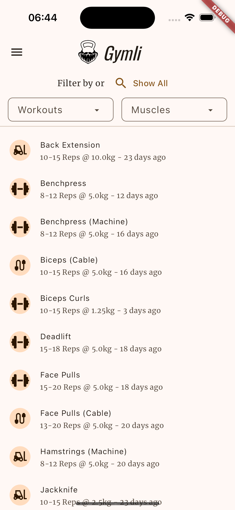
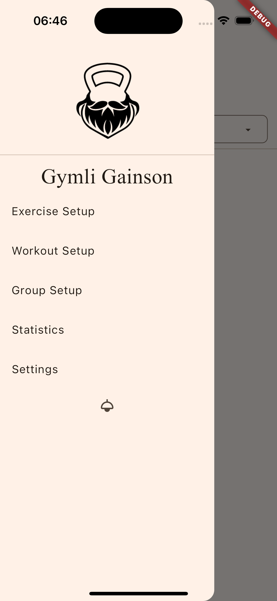
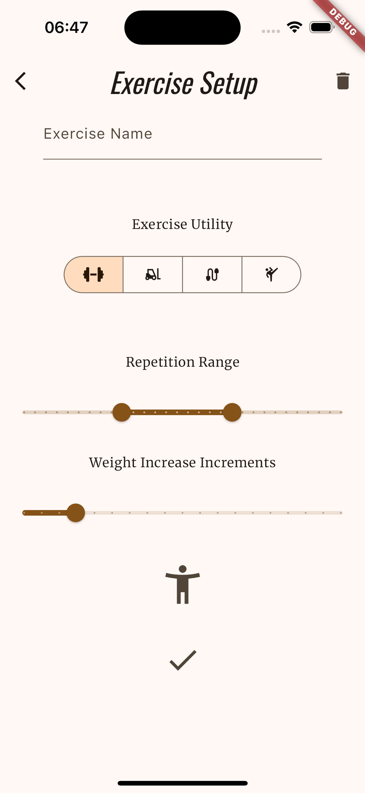
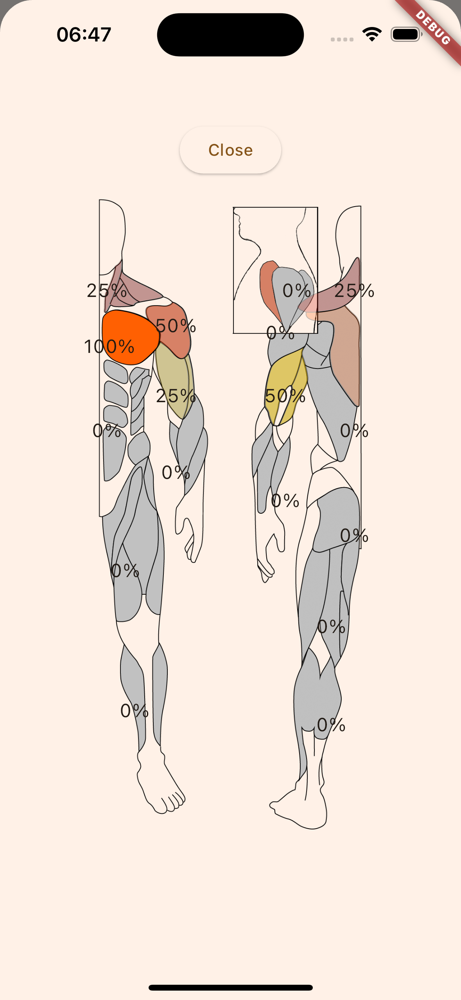
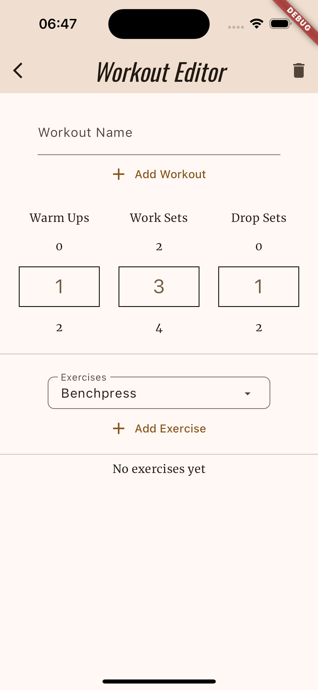
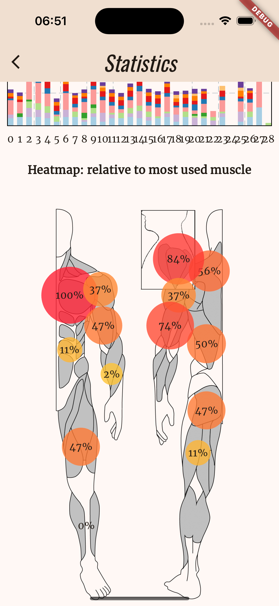
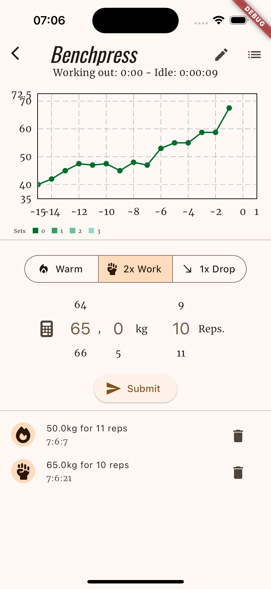
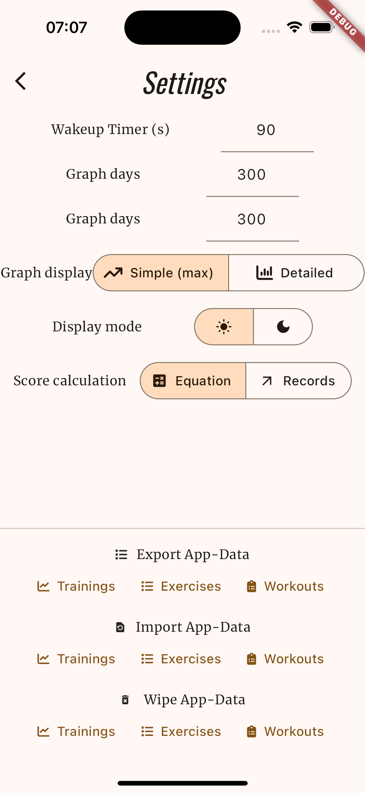

# Gymli
*Gymli, son of Gain, proud member of the fellowship of the Gym*  

Open source strength and hypertrophy training tracking app for multiple platforms 
Written in dart using googles flutter framework. 
 
An apk for android devices of a working alpha version can be found under releases. 

## Manual
Screen|Description
-|-
Main | A list of your created Exercises which can be filtered by either workouts or involved muscle groups
Exercise | create a library of your own Exercises. An Exercise is setup with a name, a repetition range, a weight inkrement (the weight you will add to an exercise when hitting your repetition maximum) and used muscle groups 
Workout | Create Workouts from a combination of your exercises with defined numbers of warmup, work and dropsets.
Settings | Change settings and Import or Export your progress and created exercises or workouts.
Statistics | nomen est omen

Workout:

## Screenshots
  | |  
-|-|-
||
||
|||

